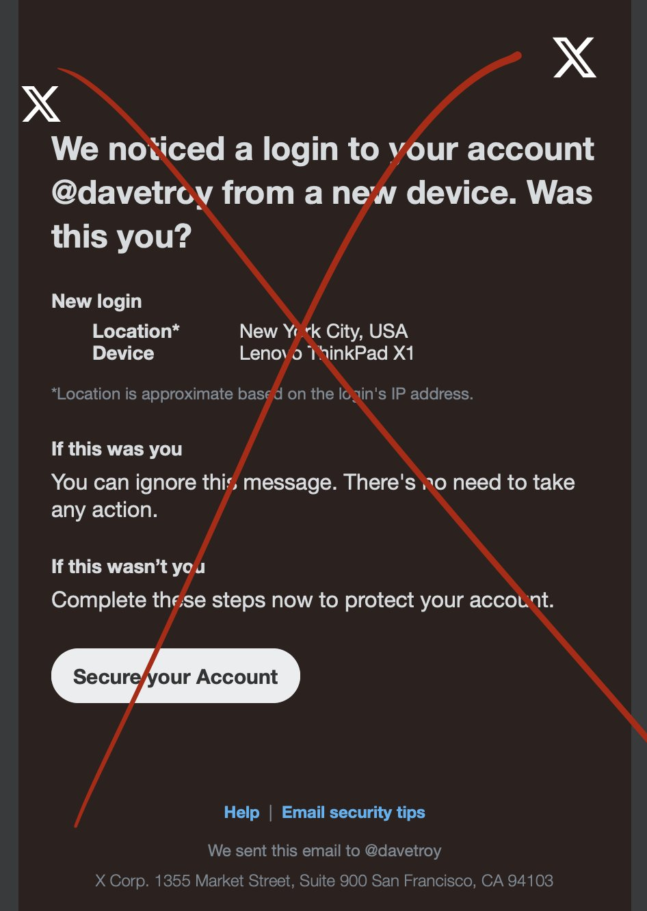

# Phishing X

Un clon de **X** (Twitter). (https://x.com/)

# Vector inicial:

Existen distintas maneras en las cuales una persona puede ser victima de phishing, pero las más comunes para X (Twitter) han sido mensajes privados por la misma plataforma y correos electronicos fraudulentos mismos que se muestran a continuación:




Una vez que el usuario da click en los enlaces es dirigido a una página de inicio de sesión como la presente, donde el usuario pone sus credenciales confiando en que está en la página real dandole acceso al atacante.

**Nota:** Las capturas son de intentos de phishing reales.

# ⚠️ ADVERTENCIA

Este proyecto fue desarrollado **exclusivamente con fines educacionales** como parte de un curso de seguridad informática. **No debe ser utilizado en ningún otro contexto ni con intenciones maliciosas.**

**Aviso Legal:**

Este código **no debe ser utilizado fuera del entorno educacional ni aplicado a sistemas en producción, redes, o dispositivos ajenos sin autorización.**
**El autor no se hace responsable por el uso indebido de este código.** Cualquier intento de utilizar este proyecto para propósitos distintos a los estipulados en este repositorio es **bajo su propia responsabilidad.**

Este proyecto tiene como **único objetivo enseñar y concientizar sobre las técnicas de ciberseguridad y los riesgos asociados.** Asegúrate de cumplir con todas las leyes y regulaciones aplicables en tu jurisdicción.

# Contexto:

El presente repositorio contiene un sitio web desarrollado con **DJANGO** el cual replica la interfaz de X (Twitter), almacena las credenciales del usuario en una base de datos de sqlite y envía un código de verificación al correo del usuario simulado mismo que se introduce en la página clonada e imprime el código de verificación en la consola.

# Requisitos:

- Python 3
- Virtualenv (pip install virtualenv)
- Dependencias de requeriments.txt
- Cuenta de mailtrap (https://mailtrap.io/)

# Instalación:

Crear un entorno virtual de python:

```bash
$ python -m venv venv
```

Activar el entorno virtual:

```bash
$ .\venv\Scripts\activate
```

Instalar las dependencias del archivo requirements.txt:

```bash
$ pip install -r requirements.txt
```

# Configuración:

Entrar a el archivo settings.py para configurar el servidor de mailtrap y poder enviar correos para un **supuesto 2FA**. A continuación un diagrama de las rutas del proyecto para encontrar el archivo:

```bash
/phishingX
│
├── phishingX/
│   └── settings.py # <--- MODIFICAR ESTE
├── x/
├── .gitignore
├── db.sqlite3
├── manage.py
├── README.md
└── requirements.txt
```

Dentro del archivo settings.py modificar las ultimas lineas que hacen referencia a mailtrap con los datos de nuestra cuenta:

```python
# MAILTRAP
EMAIL_HOST = "sandbox.smtp.mailtrap.io"
EMAIL_HOST_USER = "**************"
EMAIL_HOST_PASSWORD = "**************"
EMAIL_PORT = "2525"
```

**Nota:** Si no se configuran las credenciales correctamente no se podrá enviar el correo.

# Ejecución:

Para ejecutar el servidor web usar el comando:

```bash
$ python manage.py runserver
```

Luego abrir en el navegador el servidor web que por defecto está
en el puerto 8000:

```bash
http://127.0.0.1:8000/
```

**Nota:** Las credenciales del usuario se guardan en el archivo **db.sqlite3** en la tabla x_victim.

```

                                  *(%@@@@@*#@@@,..
                       ,/#@@@@@@@@@@@@@@@@@@@@@..
                .*#@@@@@@@@@@@@@@@@@@@@@@@@@@@..
                 *#@@@@@@@@@@@@@@.*##@@@@@@@@..
                 *#@@@@.#        *##@@@@@@@@..
                 *#@@,..*@&     *##@@@@@@@@..
                        .#@@@@@@@@@@@@@@@@...
                      .#      **@@@@@@@@@...
                       .@@@@@@%#@@@@@@@@...
                          .%@@@@@@@@@@@...
                           *##@@@@@@@@.,.
  *#@@..                 *#@@@@@@@@@@*..
    *#&@@@@..       *#@@@@@@@@@@@@@@&..
      *#@@@@@@@*#@@@@@@@@@@@@@@@@@@@..
        *#@@@@@@@@@@@@@@@@@@&,.
          *#@@@@@@@@..                   Hecho por Julio NG
```
